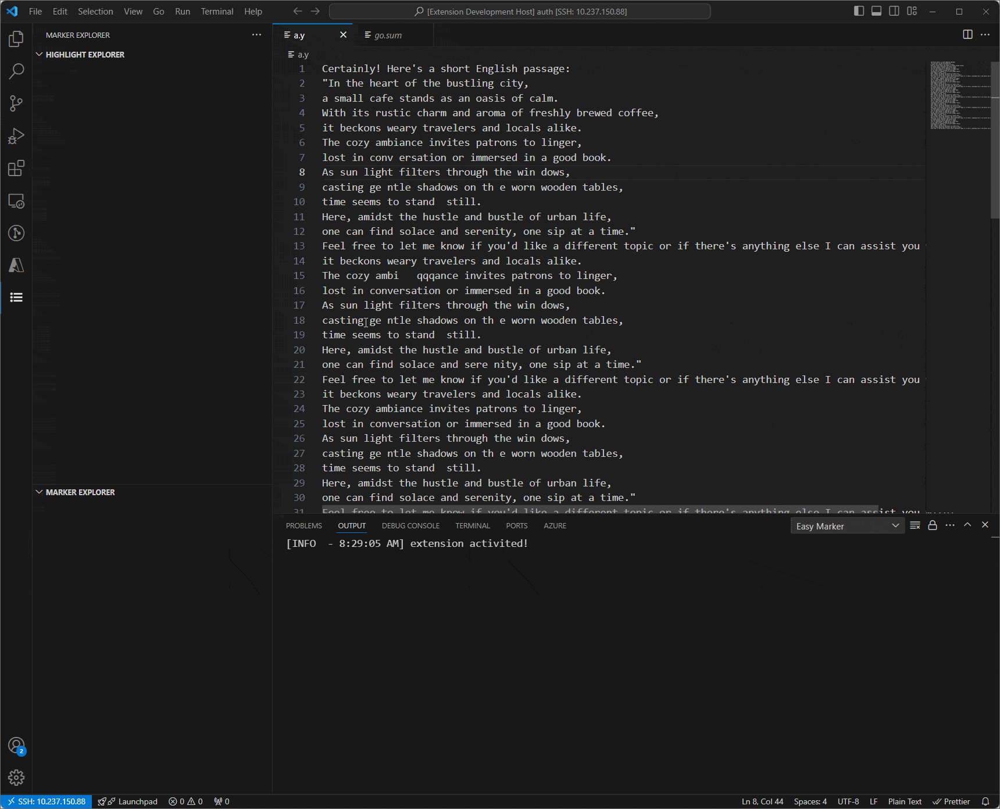
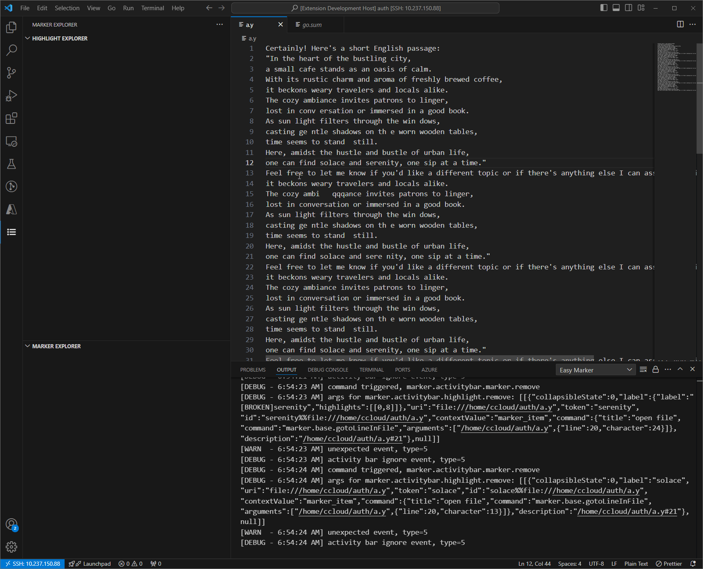

# Marker

Marker is a VS Code extension which targets support for marking important items.

## Features
- Highlight the item
  Highlighting applies to all files and currently supports a maximum of 10

- Mark the item
  Once terms are marked, users can access them later via the sidebar for quick navigation

## Extension Settings

No settings for now

## Known Issues

- Only support less than 10 highlights

---

## Release Notes

All notable changes to this project will be documented in this file.

### 0.0.4
- Support marking important items
- Printing logs in output channel "Easy Marker"
- Disable highlighting empty selection
- Moving "Dark Gray" to the end choice.
