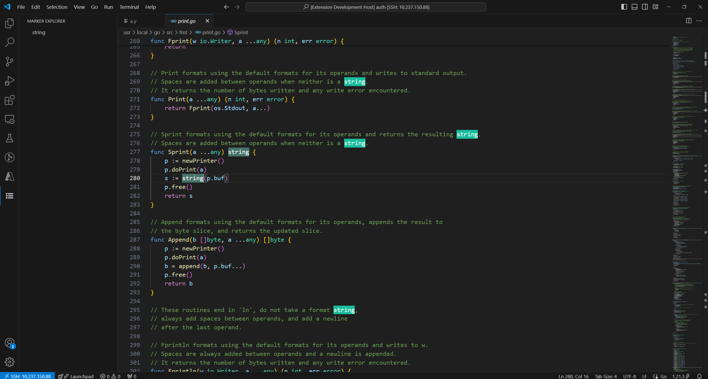

# Marker

Marker is a VS Code extension which targets support for marking key words.

## Features

- Highlight the key word

## Extension Settings

We don't have any settings for now

## Known Issues

- Only support less than 10 markers

---

## Release Notes

All notable changes to this project will be documented in this file.

### 1.0.0
